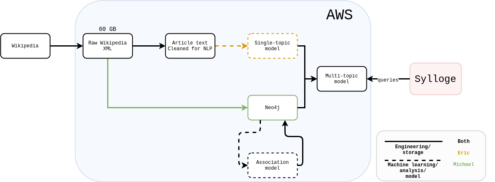

# Sylloge Spec

## Purpose and basics

Sylloge is a topic search system whose purpose is to increase the long-term value of a corpus of text to readers and writers. The user provides a search term ("topic") and is returned a document which contains all selections from the corpus that match the topic, and which is itself organized by the source document of each selection. This should be especially useful with corpora containing very long documents which cover many different topics (e.g., books, detailed book reviews/summaries, etc).

The topic tagging NLP model (which determines whether a selection should be returned in a topic search) will be trained on Wikipedia data - this will restrict query-able topics to Wikipedia article titles (at least as far as the NLP model is concerned - we can still do plaintext search for arbitrary strings). A selection of text will be determined as relevant to a topic if the selection is linguistically similar to the topic's Wikipedia page, **or** if it is linguistically similar to Wikipedia pages which are "close" to the topic's Wikipedia page. "Close" is measured by hyperlinks and Wikipedia "metastructures" (e.g., [Categories](https://en.wikipedia.org/wiki/Category:2007_video_games), [Portals](https://en.wikipedia.org/wiki/Portal:History), etc).

### A clarification

The original motivation of Sylloge was to maximize the value of the users' own personal writings (such as a blog, or a personal collection of book summaries), ideally with the consequence of encouraging the user to write more by providing a way to usefully access their writings by topic. While this may continue to be a focus of the project, I have realized from scraping a blog (in order to provide some testing data) that indexing _others'_ writings may be just as useful. For instance, the user could add their favorite bloggers or writers to their corpus and easily search through their collected writings. Alternatively, bloggers could add this functionality to their site. Robin Hanson, Tyler Cowen, etc have all written enormous amounts of blog posts. Ideally, Sylloge would provide a better solution to search than bloggers' manual tagging, and plaintext search.

## NLP and the multi-topic model

The primary building block of Sylloge is what we'll call the **single-topic model**. This is a standard topic tagging NLP model **trained on Wikipedia**, whose input is a topic and a selection of text, and whose output is a boolean indicator of whether the text is a match for the topic. This can either be a simple bag-of-words approach ("does the frequency of each word in the selection from the corpus roughly correspond to the frequency of each word in the topic's wikipedia page?") or any of a number of more advanced models.

On its own, this approach is limited. Imagine a section of an essay talking about [Touch of Evil](https://en.wikipedia.org/wiki/Touch_of_Evil). We could have the best NLP model in the world, which could identify a selection of text as being about Touch of Evil even without mentioning the name of the film ("Now let's talk about Orson Welles's 1958 classic, which is so legendary I don't even need to say the name.")

However, what if the user instead searched for film noir? Surely we would want this selection to be returned to the user. But would it? The language used in our selection might be similar enough to the [film noir page](https://en.wikipedia.org/wiki/Film_noir) (perhaps based on the frequency of Welles's name alone), but then again it might not. The phrase "film noir" is only used two times in the article's text.

Other examples are easy to think of. Is a selection of text which is about Super Mario Galaxy likely to be linguistically similar to the [video game Wikipedia page](https://en.wikipedia.org/wiki/Video_game)? Probably not. Do we want a search for "video game" to return this selection? Definitely.

Solution: the **multi-topic model**. In the film noir example, the very first link in the Touch of Evil article text is to the film noir page. At the bottom of the article, we see that one of Touch of Evil's categories is film noir. Our text selection may not be similar to the text of the film noir page, but it *is* similar to a page that is clearly connected to film noir. So: we can use the structure of Wikipedia to build a meta-model which matches text to topic either by similarity between text and topic, or by similarity between text and adjacent-topic.

To facilitate this, we will use [Neo4j](https://en.wikipedia.org/wiki/Neo4j) to store the [Wikipedia data](https://en.wikipedia.org/wiki/Wikipedia:Database_download) in a graph format. Nodes are articles, edges are links. We will need to construct our own links which determine the rules of whether similarity to page x should trigger a match on page y (this might not be transitive!). I call this the **association model**: it is what ties the single-topic models together into a multi-topic model. It will also live in Neo4j.

### Exact matches

Naturally, we will want exact matches to hit. For instance, a "Super Mario Galaxy" search should return a selection which includes "Super Mario Galaxy" in the text, even if the NLP model wouldn't return a hit. We will still use the multi-level model here - so a search for "video game" should also return such cases.

Here's an important thought: **exact matches, combined with the association model, could get us 90% of the way there without NLP**. NLP would be nice to have, but basically having a multi-level model where the single-topic model is simplified to just "does term show up in document" could be very powerful on its own.

### Imbalanced training set (new thought)

At least how the single-topic portion works in my head, any given topic will have orders of magnitude more 0 training cases than 1s. Only one article per topic. Not sure if oversampling makes sense in the context of NLP.

But one solution here: we can also throw in text from the articles that _link to_ the topic. Not the entire article: we need to isolate the neighborhood around where the link happens. Ideally we could also take other non-linking mentions in the linking articles, but this is a lot harder in the cases of small/common/ambiguous words.

## Infrastructure and workflow

Above is the rough workflow and data flow for the project.

## Interface

Need to flesh out ideas for this. Not urgent, though. Creating the actual interface will likely be the last part - we will probably just be generating markdown files for a while.

### Result presentation

I've mentioned that results should be organized by source document, but I think that may be just a sub-level. With the multi-topic model in mind, it would be great for the top-level organization to be defined by which Wikipedia topic was matched: the Wiki topic of the actual search term, or of an adjacent page? For instance, results for a search for "video game" could look like:

- Selections matching "video game"
  - Paragraphs 3-5 of document abc (exact match)
    - ...video game...
  - Paragraphs 10-15 of document def
    - ...controller...Atari...Miyamoto... (NLP match)
- Selections matching "Super Mario Galaxy"
  - Paragraphs 5-8 of document xyz
    - ...Super Mario Galaxy... (exact match)

### Results ordering

For certain searches, ordering will be very important. If a search term's Wiki page connects to many other pages, we could end up with too many results. Here are some dimensions along which we can order results.

- **Relevance**. This is just NLP-based: how close does the text of a neighborhood match the search term's Wiki page (or its respective adjacent term's wiki page)? See the Coldplay example in [this mockup](mockup.md).
- **Distance from adjacent term to search term**. For adjacent matches (e.g., search for film noir, return a match to Touch of Evil), our main criterion will be the mere existence of a direct Wiki linkage from one page to the other. However, we can get a better sense of how related the terms are if we look at their common linkages, or alternate paths to get from one to the other.
  - Common linkages: what is the intersection our pages links to other pages? For instance, both pages links to Orson Welles. How many of these are there?
  - Alternate paths: how many ways can you get from page A to page B in under n steps (other than the direct linkage)? This is similar to "common linkages" but may be a better way of thinking about it. I'd be surprised if neo4j couldn't easily handle both. 
- **Page importance**. in a broad sense, how popular/detailed/important/etc is the page? A natural way to measure this is to use Pagerank (for which there is at least one Neo4j implementation). Another way is simply by the length of the page. This may require some tweaking, but I think it's overall a pretty good measure. Long articles are long for a reason. [Idaho Statesman](https://en.wikipedia.org/wiki/Idaho_Statesman) vs. [The New York Times](https://en.wikipedia.org/wiki/The_New_York_Times), [Paranoid](https://en.wikipedia.org/wiki/Paranoid_(album)) vs. [Forbidden](https://en.wikipedia.org/wiki/Forbidden_(Black_Sabbath_album)), etc.

We may end up needing to create a composite score out of all of these.

### Result expansion

Long documents which match basically all the way through (say, >50% of [neighborhoods](#note-on-neighborhoods) match) should be truncated, ideally with an option to expand. 

### Custom topic distance

One option we could provide to users is the ability to "expand the search" by being more lax in our association model rules. For instance, allowing Super Mario Galaxy to show up in searches for Mario Kart Wii; there is no direct link from Super Mario Galaxy to Mario Kart Wii, but you can get from one to the other through the Wii page.

## Note on neighborhoods

We need to check different neighborhoods of each source document against the model. We're not just trying to find source documents that match our search term - we want _selections from_ source documents that match. But how big are the "neighborhoods" that define our candidates for selection? Too narrow, and the returned selections will be too out-of-context. Too wide, and there will just be too much text returned from each hit. Simple options for delineating neighbhorhoods: paragraphs, or a set number of sentences.  Another option could be a minimum/maximum between paragraphs and words/characters. As many full paragraphs as are required to reach 100 words, or something like that.

There may be some kind of mathematical trick here if the model is simply frequency-based. Like a kernel density estimate (moving average, basically) combined with a minimum density cutoff. This way we just have a score at each word which gets its actual "neighborhood" score and we only take sentences whose words all score above the cutoff. This seems more elegant.
